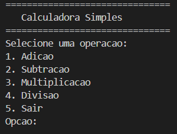
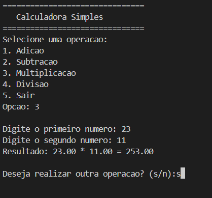

# 🧮 Calculadora C

Uma calculadora simples desenvolvida em linguagem C, executada diretamente no terminal.  
Permite realizar operações matemáticas básicas: **adição**, **subtração**, **multiplicação** e **divisão** com validação de entradas e opção para repetir cálculos.

---

# 📷 Imagem do programa



---

## 🚀 Instalação e Pré-requisitos

### 📦 Pré-requisitos
- [GCC](https://gcc.gnu.org/) (ou outro compilador C)
- Terminal para execução

### 📥 Passos para rodar

1. Clone o repositório:
   ```bash
   git clone https://github.com/itsinacio/calculadora-c.git

2. Acesse a pasta do projeto: 
   ```bash
   cd calculadora-c

3. Compile o código:
   ```bash
   gcc src/calculadora.c -o calculadora

4. Execute o programa:
    ```bash
   ./calculadora

---

## ⚡ Uso e Exemplos

Abaixo está um exemplo de como a Calculadora C funciona no terminal:



---

## 📂 Estrutura do Projeto

calculadora-c/
├── assets/
│   └── exemplo_do_codigo.PNG
│   └── imagem_demonstrativa_do_codigo.PNG
├── src/
│   └── calculadora-c.c
├── LICENSE
└── README.md

---

## 📄 Licença

Este projeto está licenciado sob a MIT License - veja o arquivo LICENSE para mais detalhes.